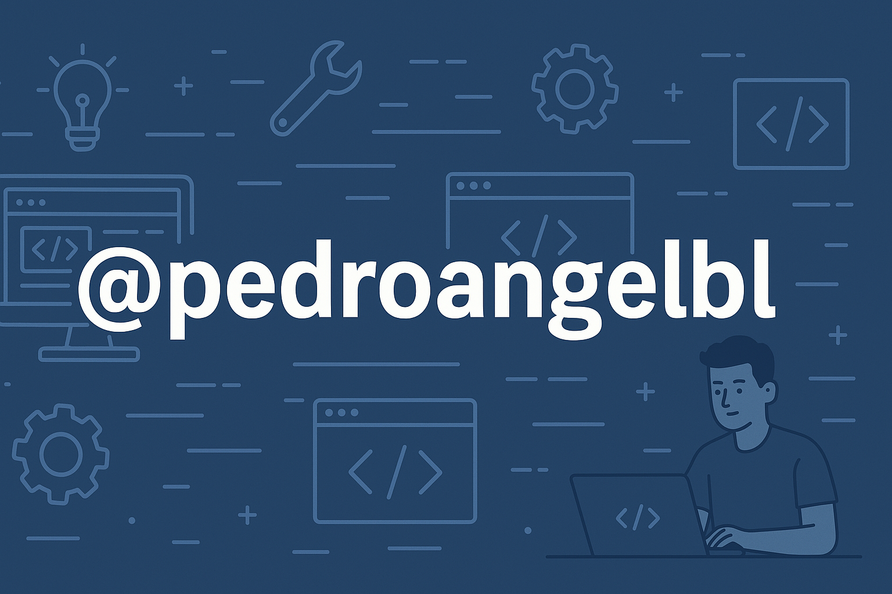

  <h1 align="center">Hola, soy <a href="https://aristi.dev">Pedro Ángel</a> 👋</h1>

<!-- Banner -->
</img>

<!-- Badges redes sociales -->

## Sobre mi

- ⭐ Github Star ⭐
- 🌐 Web Developer | 📲 Mobile first
- 💻 Diseño páginas web robustas y escalables
- Actualmente trabajando para Studio128k

## <b> Skills</b>

- **Web Development**:

   
   
   
   
   
   

 

- **Frameworks**:

    
    
    
    
    
    

 

- **Cloud Hosting**:

    
    
    
    
 

- **Softwares and Tools**:

    
    
     

## ⚙️ &nbsp;GitHub Analytics

    
    

